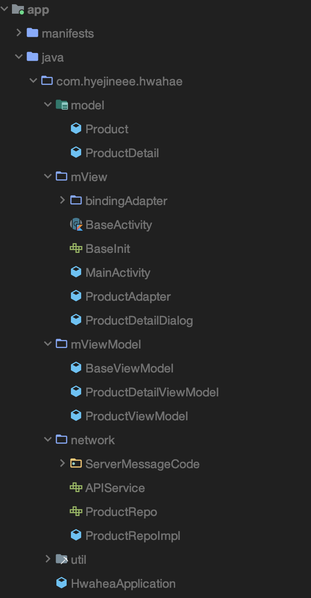

# Hwahea challenge

- 리팩토링 중,,,, 문서 작성 중,,,,
- 프로그래머스에서 진행한 화해 앱 개발 챌린지
- 2020. 01. 06 ~ 2020. 01. 28
- [https://github.com/hyejineee/Hwahae-Android-challenge](https://github.com/hyejineee/Hwahae-Android-challenge)

## 🙌🏻 무엇을 만들었는가?

화해 앱 개발 챌린지의 과제는 제공하는 화장품 정보 API를 통해 정보를 보여주는 애플리케이션을 만드는 과제였다. 세부 기능으로 먼저 메인 화면에는 화장품 목록 리스트를 보여 주어야 하고 리스트의 아이템을 클릭시 상세 정보를 보여주는 기능을 구현해야 했다. 또 리스트 화면에서 검색어를 입력하거나 필터를 설정할 경우 조건에 부합하는 화장품의 목록을 보여주는 기능을 구현해야 했다.  

## 🤔 어떻게 만들었는가?

오랜만에 안드로이드 개발을 하니 여러 구조를 참고하면서(~~클린 아키텍처 집착..~~.) 하다가  엉망진창인 폴더 구조와 소스코드를 작성하게 되었다. 챌린지가 끝난 후에 다시 코드를 보니 🤭왜 이렇게 짰을까...?🤭 하는 부분들이 상당히 많은 것 같다. 

그래서 폴더 구조부터 차례 차례 고치려고 한다. 

리팩토링 전 프로젝트 폴더 구조... (~~지저분해~~)

1. 애플리케이션 사용자 플로우 

    화장품에 대한 정보를 보여주기만 하는 간단한 애플리케이션이기 때문에 사용자 플로우도 매우 간단하다. 

    먼저 애플리케이션을 실행하면 모든 타입의 화장품 리스트와 검색창, 필터 스피너가 보인다. 검색과 필터 적용시 조건에 해당하는 화장품의 리스트가 보여지게 되고 화장품 리스트의 아이템을 클릭하면 화장품 상세 다이얼로그가 뜬다.

    

2. 애플리케이션 구조 (→ 의존성 방향)

    

    viewModel을 대대적으로 고쳐야 할 것 같다...

3. 구현한 기능
    - 기본 화장품 리스트 보여주기
    - 검색 키워드가 들어가 있는 화장품 리스트 보여주기
    - 
4. 리팩토링 

    

    경우에 따라 body에 jsonArray,string, jsonObject이 들어간다... 

    그래서 okhttp에 network interceptor를 추가했다. 

    - 원래 코드

            when (statusCode) {
            	  StatusCode.STATUS_ERROR.code -> {
            	      when {
            	          body.toString().contains(BodyMessage.PAGE_ERROR.message) ||
            	                  body.toString().equals(BodyMessage.SKIN_TYPE_ERROR.toString()) -> {
            	              observer.onError(Exception(body.toString()))
            	          }
            	          body.toString().contains(BodyMessage.NO_DATA.message) -> {
            	              observer.onNext(emptyList())
            	              observer.onComplete()
            	          }
            	          else -> observer.onError(Exception(body.toString()))
            	      }
            	
            	  }
            
            	  StatusCode.STATUS_SUCCESS.code -> {
            	      val listType: Type = object :
            	          TypeToken<List<Product?>?>() {}.getType()
            	      val products = Gson().fromJson<List<Product>>(
            	          body,
            	          listType
            	      )
            	      observer.onNext(products)
            	      observer.onComplete()
            	  }
            	  else ->
            	      observer.onError(Exception(body.toString()))
            }

    - 수정 후 코드

            when (r.isSuccessful) {
                true -> {
                    observer.onNext(r.body()?.body?: emptyList())
                    observer.onComplete()
                }
                else -> {
                    when{
                        r.message().contains(BodyMessage.NO_DATA.message) -> {
                            observer.onNext(emptyList())
                            observer.onComplete()
                        }
                        else -> observer.onError(Exception(r.message()))
                    }
                }
            }

            class ResponseInterceptor : Interceptor {
                override fun intercept(chain: Interceptor.Chain): Response =
                    chain.proceed(chain.request()).let {
            
                        val responseStr = it.body()?.string()
            
                        val newResponse = it.newBuilder().apply {
                            val toJson = JSONObject(responseStr)
            
                            when (toJson.getInt("statusCode")) {
                                StatusCode.STATUS_SUCCESS.code ->
                                    this.code(200)
            
                                else -> {
                                    this.code(400)
                                    this.message(toJson["body"].toString())
                                }
                            }
                        }
            
                        newResponse.body(
                            ResponseBody.create(
                                it.body()?.contentType(),
                                responseStr
                            )
                        )
                    }.build()
            }

## 🙋🏻‍♀️ 무엇을 배웠는가?

- 안드로이드 테스트
- 리액티브 프로그래밍

## 🤦🏻‍♀️ 아쉬운 점

-